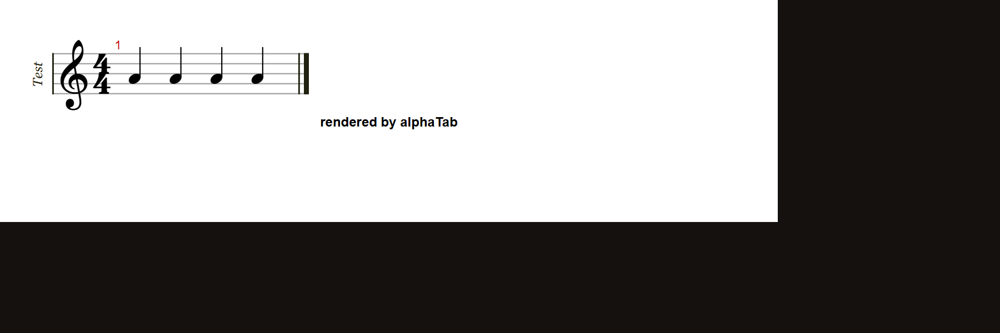

# alphaTab: a per-note `<instrument>` reference suppresses accidental rendering for the whole bar

**Project:** [CoderLine/alphaTab](https://github.com/CoderLine/alphaTab)
**Suggested title:** MusicXML import: per-note `<instrument>` element breaks accidental display for the entire measure
**Environment:** @coderline/alphatab 1.8.3 (also present in the 1.8.3 minified `alphaTab.core.mjs`/`alphaTab.js` bundles), Chromium (headless + regular), SVG rendering mode

## Summary

When a `<note>` in an imported MusicXML file carries an `<instrument id="...">` child
element — even one that correctly references a `<score-instrument>` declared in
`<part-list>` — **every accidental (sharp/flat/natural) in that measure fails to render**,
for every note in the bar, not just the one carrying the `<instrument>` tag. The underlying
pitch is parsed correctly (`<alter>` is honored, so playback pitch is correct); only the
**visual** accidental glyph is missing.

This matters because `music21` (a common MusicXML authoring/round-trip library) writes an
`<instrument>` reference on **every note unconditionally**, even for a single-instrument
part — so any file that has passed through music21 is silently missing every accidental
when rendered by alphaTab.

## Steps to reproduce

Minimal repro — a single measure, four quarter notes on A4 (natural, sharp, natural,
natural), in C major, with a `<score-instrument>` properly declared and referenced by every
note:

```xml
<?xml version="1.0" encoding="UTF-8"?>
<score-partwise version="4.0">
  <part-list>
    <score-part id="P1">
      <part-name>Test</part-name>
      <score-instrument id="I1"><instrument-name>Violin</instrument-name></score-instrument>
      <midi-instrument id="I1"><midi-channel>2</midi-channel><midi-program>41</midi-program></midi-instrument>
    </score-part>
  </part-list>
  <part id="P1">
    <measure number="1">
      <attributes>
        <divisions>1</divisions>
        <key><fifths>0</fifths></key>
        <time><beats>4</beats><beat-type>4</beat-type></time>
        <clef><sign>G</sign><line>2</line></clef>
      </attributes>
      <note>
        <pitch><step>A</step><octave>4</octave></pitch>
        <duration>1</duration>
        <instrument id="I1" />
        <type>quarter</type>
        <stem>up</stem>
      </note>
      <note>
        <pitch><step>A</step><alter>1</alter><octave>4</octave></pitch>
        <duration>1</duration>
        <instrument id="I1" />
        <type>quarter</type>
        <accidental>sharp</accidental>
        <stem>up</stem>
      </note>
      <note>
        <pitch><step>A</step><octave>4</octave></pitch>
        <duration>1</duration>
        <instrument id="I1" />
        <type>quarter</type>
        <stem>up</stem>
      </note>
      <note>
        <pitch><step>A</step><octave>4</octave></pitch>
        <duration>1</duration>
        <instrument id="I1" />
        <type>quarter</type>
        <stem>up</stem>
      </note>
    </measure>
  </part>
</score-partwise>
```

```js
const api = new alphaTab.AlphaTabApi(el, { core: { fontDirectory: '.../alphatab/font/' } });
api.load(new TextEncoder().encode(xml));
```

## Expected

The second note renders with a sharp (♯) before it — same as any plain MusicXML with an
`<accidental>sharp</accidental>` element.

## Actual

**No accidental renders at all**, on any note in the bar:



Removing only the four `<instrument id="I1" />` elements (nothing else changed — same
`<accidental>`, same key signature, same notes) fixes it immediately:


## Isolation performed

- Confirmed the pitch data itself is unaffected (`<alter>1</alter>` is parsed correctly;
  only the drawn glyph is missing) — audio playback is correct, only visual rendering fails.
- Confirmed it is **not** about an *undeclared* instrument id — reproduces identically
  whether `id="I1"` is a dangling reference or is properly declared via `<score-instrument>`
  / `<midi-instrument>` in `part-list` (as shown above).
- Confirmed it is **not** related to beaming, note duration (reproduces with plain quarter
  notes), divisions magnitude, or the position of the sharped note within the measure
  (reproduces whether the sharped note is first, last, or in the middle of the bar).
- Bisected down to this exact 2-line change (removing the `<instrument>` element) as the
  sole variable that flips the bug on/off.

## Suggested root cause (from reading the bundled/minified source, not the original TS)

In the MusicXML importer's per-`<note>` `switch` (`_parseNote`-equivalent in the bundle),
`case "instrument":` sets `instrumentId` but doesn't appear to interact with pitch/accidental
state directly — the actual failure surfaces later in `AccidentalHelper._getAccidental` /
`ModelUtils.computeAccidentalForSpelling`, which track a per-bar `_registeredAccidentals`
map keyed by staff-line position ("steps"). It's likely that per-note `<instrument>`
references cause notes to be routed through a different staff/voice context than expected
(relevant for grand-staff or multi-instrument parts), which in a single-instrument context
desyncs the accidental bookkeeping for the whole bar. Worth checking whether `staffIndex` or
per-instrument voice assignment is being derived from `<instrument>` in a way that doesn't
degrade gracefully when there's only one instrument.

## Real-world impact

Found while comparing a Soundslice-exported fiddle tune's rendering in this library against
Soundslice's own player. Affected **7 separate accidentals across a single 32-bar tune**
(and would affect any file emitted by any tool — like music21 — that writes an
`<instrument>` reference on every note by convention).
