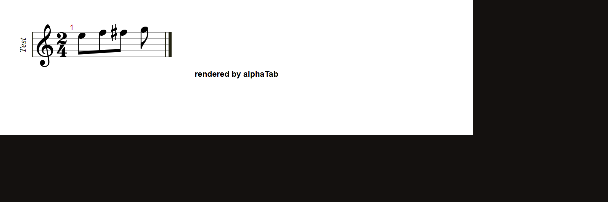

# alphaTab: a piece's opening unbeamed note gets merged into the following beam group

**Project:** [CoderLine/alphaTab](https://github.com/CoderLine/alphaTab)
**Suggested title:** MusicXML import: the first note of a part can be wrongly auto-beamed into the next explicit beam group
**Environment:** @coderline/alphatab 1.8.3, Chromium (headless + regular), SVG rendering mode

## Summary

alphaTab decides whether a part uses **explicit** MusicXML beam markup (vs. relying on its
own auto-beaming) by watching, in document order, for the first `<note>` that carries a
`<beam>` child element. Until that happens, notes *without* a `<beam>` element fall back to
**auto-beaming** instead of being treated as intentionally standing alone.

This is a one-way latch that, once set, correctly stays on for the rest of the part. But it
means: **if a part's very first note is meant to stand alone, and the note immediately
after it is the first one in the file to carry an explicit `<beam>` tag, the opening note
gets auto-beamed into that following group** — even though the MusicXML explicitly omits any
`<beam>` element on it (the standard way of saying "this note isn't beamed").

Because the latch is set permanently by the *first* beamed note encountered — which in
practice is often extremely early in a real piece — this bug can really only ever affect a
part's opening note(s), and only when they happen to precede the first beamed group. It
never recurs later in the same piece.

## Steps to reproduce

Minimal repro — 2/4 time, four eighth notes: `E5` (deliberately **unbeamed** — no `<beam>`
element), then `F5`–`F♯5` (explicitly beamed to each other), then `G5` (unbeamed):

```xml
<?xml version="1.0" encoding="UTF-8"?>
<score-partwise version="4.0">
  <part-list>
    <score-part id="P1"><part-name>Test</part-name></score-part>
  </part-list>
  <part id="P1">
    <measure number="1">
      <attributes>
        <divisions>2</divisions>
        <key><fifths>0</fifths></key>
        <time><beats>2</beats><beat-type>4</beat-type></time>
        <clef><sign>G</sign><line>2</line></clef>
      </attributes>
      <note>
        <pitch><step>E</step><octave>5</octave></pitch>
        <duration>1</duration>
        <type>eighth</type>
        <stem>down</stem>
      </note>
      <note>
        <pitch><step>F</step><octave>5</octave></pitch>
        <duration>1</duration>
        <type>eighth</type>
        <stem>down</stem>
        <beam number="1">begin</beam>
      </note>
      <note>
        <pitch><step>F</step><alter>1</alter><octave>5</octave></pitch>
        <duration>1</duration>
        <type>eighth</type>
        <accidental>sharp</accidental>
        <stem>down</stem>
        <beam number="1">end</beam>
      </note>
      <note>
        <pitch><step>G</step><octave>5</octave></pitch>
        <duration>1</duration>
        <type>eighth</type>
        <stem>down</stem>
      </note>
    </measure>
  </part>
</score-partwise>
```

```js
const api = new alphaTab.AlphaTabApi(el, { core: { fontDirectory: '.../alphatab/font/' } });
api.load(new TextEncoder().encode(xml));
```

## Expected

`E5` renders as a standalone flagged eighth note. `F5`–`F♯5` render as a beamed pair. `G5`
renders as a standalone flagged eighth note. (This is exactly how the same MusicXML renders
in other engraving tools, e.g. Soundslice's own player.)

## Actual

`E5` is drawn beamed together with `F5`–`F♯5` (a 3-note beam group), even though `E5` carries
no `<beam>` element at all:



`G5` (also unbeamed, but occurring *after* the beam-markup latch has been set by `F5`)
correctly renders standalone — confirming the bug is specific to notes preceding the first
explicit `<beam>` element, not a general "ignore beam data" issue.

## Isolation performed

- Confirmed the note/pitch/duration data is unaffected — this is purely a visual grouping
  difference.
- Confirmed the bug disappears if any earlier note in the same part already carries an
  explicit `<beam>` tag (i.e., it's specifically about *document-order position relative to
  the first beamed note*, not about `E5` itself).
- Checked across four independently-transcribed real tunes: the bug fired only when a
  tune's literal first note was unbeamed and immediately followed by a beamed group; it
  never appeared anywhere else in any of the four (i.e., is not a general per-measure
  recurring issue — the latch, once set, stays set for the rest of the part as expected).

## Suggested root cause (from reading the bundled/minified source, not the original TS)

In the MusicXML importer, a per-staff-context flag `isExplicitlyBeamed` starts `false` and is
only set `true` inside the branch that fires when the *current* note's `<beam>` element
resolves to a non-null `beamMode` (i.e., `"begin"`/`"continue"`/`"end"`):

```js
if (beamMode === null) {
  newBeat.beamingMode = this._getStaffContext(staff).isExplicitlyBeamed
    ? BeatBeamingMode.ForceSplitToNext
    : BeatBeamingMode.Auto;
} else {
  newBeat.beamingMode = beamMode;
  this._getStaffContext(staff).isExplicitlyBeamed = true;
}
```

Because this check happens per note in document order, any unbeamed note parsed *before*
the first beamed note anywhere in the part sees `isExplicitlyBeamed === false` and falls
through to `Auto` instead of the presumably-intended `ForceSplitToNext`. A fix likely needs
to pre-scan the part (or at least the current measure) for *any* explicit `<beam>` element
before deciding a given unbeamed note's fallback mode, rather than relying on a strictly
sequential, reactive latch.

## Real-world impact

Found while comparing a Soundslice-exported fiddle tune's rendering in this library against
Soundslice's own player — the tune's opening note rendered merged into the following phrase
instead of standing alone as written.
